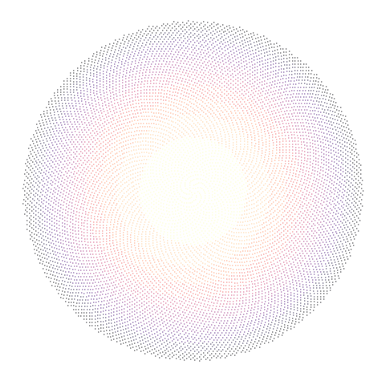

## Welcome to my portfolio!


```{r setup, echo = FALSE, warning=FALSE, message = FALSE}
library(ggplot2)
library(gganimate)
```

```{r, echo=FALSE,warning=FALSE, message = FALSE, fig.height=6, fig.width=6, fig.align='center'}


```


**It is not knowledge, but the act of learning, not possession but the act of getting there, which grants the greatest enjoyment.**

(*Carl Friedrich Gauss*)

```{r, include = FALSE}
#[click here](fibonacci_spirals.html) to see how I made a similar animation.
```