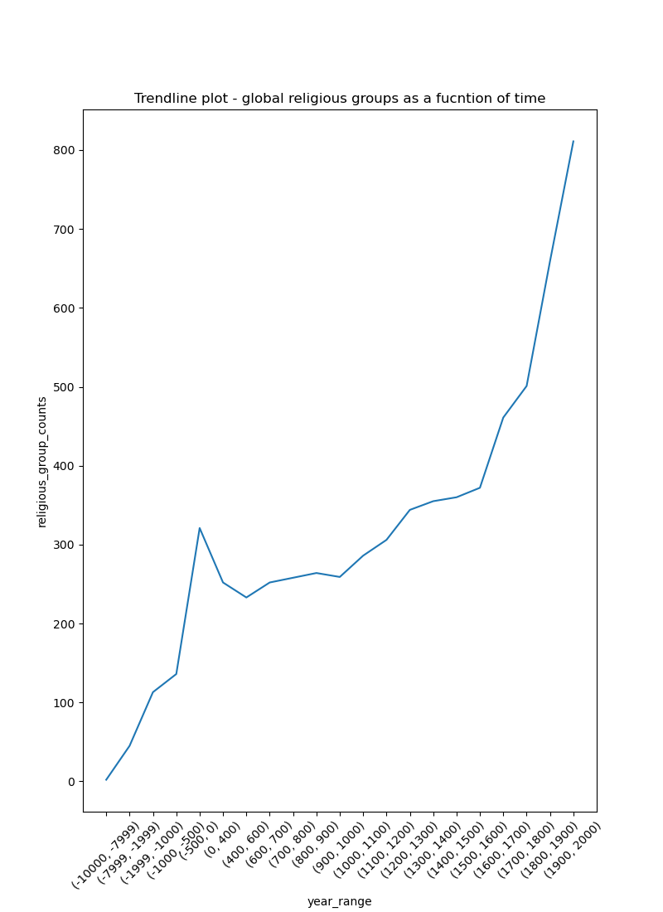

**Data Source:** [The Database of Religious History](https://religiondatabase.org/)


**Languages:** *Python*


**Libraries:** 


* Webscraping:  *selenium*
* Data Cleaning: *pandas, geopandas, google geocoding api, countryconverter*
* Visualization: *pandas, numpy and plotly*


**Code and Notebooks:** [Github link](https://github.com/AmberHabib/religious_history_project)


For this project, I scraped the data from [this webpage](https://religiondatabase.org/browse/regions). I wanted to explore the evolution of religion, in terms of spread of religious groups throughout the globe over time. 

After scraping, and preliminary cleaning I started working on the visualizations exploring the prevalence of religion and the relationships between various continents and regions. The oldest reported religious group from the source points back to 9700BCE.Some of the biggest challenges that I faced arose because a lot of the historical data from the source was reported using the ancient region names, which mapped to incorrect locations on the map. In some cases, the region information reported by the source was very broad (ex. Asia,Africa etc.) which could not be mapped precisely on a geospatial graph. 
The plot below shows the religious groups on a geographic map. The points are colored by continent and the size of the marker is proportional to the count of religious groups reported in a given region. These plots are interactive and additional information for these points is displayed upon hover. 


```{r setup, include=FALSE}
knitr::opts_chunk$set(echo = TRUE)
```


```{r, echo = FALSE, out.width="100%"}
knitr::include_url("religious_history_project/religion_by_continent.html", height="700")
```


The radial plot below shows the religious group counts by regions and continents. The longest rays correspond to the regions with highest counts of religious groups reported over time. Here we can see that China leads overall with 177 groups reported, followed by Greece and then Syria.


```{r, echo = FALSE, out.width="100%"}
knitr::include_url("religious_history_project/religion_radial_plot_global_nolabels.html", height="700")
```


The next radial plot divides the data by continent, letting us zoom in on each continent individually to better visualize the key players, i.e. the regions with the greatest religious activity over time. 


```{r, echo = FALSE, out.width="100%"}
knitr::include_url("religious_history_project/religion_radial_plot_by_continent.html",height = "900")
```


Finally, a trend line showing the global counts of religious groups as a function of year ranges. 


{width=50% height=50%}

[Click here]('religious_history_anim.html') to see the geospatial time series visualizations of this data. 


